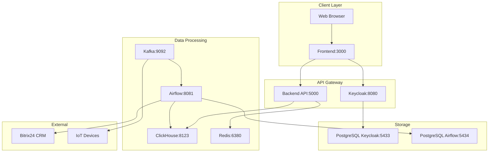

# BionicPRO Reports System

**Система мониторинга и отчетности для протезных устройств**


## 📖 Описание проекта

BionicPRO Reports System — это микросервисная система для мониторинга, анализа и отчетности работы бионических протезных устройств. Система обеспечивает:

- **Сбор телеметрии** в реальном времени с протезных устройств
- **Аналитические отчеты** по использованию и эффективности
- **Мониторинг здоровья** батарей и компонентов
- **Интеграцию с CRM** системами (Bitrix24)
- **Безопасный доступ** через JWT аутентификацию
- **Масштабируемую обработку данных** с помощью ETL пайплайнов

## 🏗️ Архитектура системы

### Основные компоненты

| Сервис | Технология | Порт | Описание |
|--------|------------|------|----------|
| **Frontend** | React + TypeScript | 3000 | Веб-интерфейс пользователя |
| **Backend API** | Flask + Python | 5000 | REST API для отчетов |
| **Аутентификация** | Keycloak | 8080 | Управление пользователями и безопасность |
| **Аналитическая БД** | ClickHouse | 8123 | OLAP база для быстрых аналитических запросов |
| **Оркестратор ETL** | Apache Airflow | 8081 | Управление пайплайнами обработки данных |
| **Стриминг** | Apache Kafka | 9092 | Потоковая обработка телеметрии |
| **Кеширование** | Redis | 6380 | Кеш для API и сессий |
| **БД Keycloak** | PostgreSQL | 5433 | База данных аутентификации |
| **БД Airflow** | PostgreSQL | 5434 | Метаданные ETL процессов |

### Диаграмма архитектуры



## 📋 Системные требования

### Обязательные требования

- **Docker** и **Docker Compose** (последние версии)
- **Минимум 8GB RAM** (рекомендуется 16GB)
- **Минимум 10GB свободного места** на диске
- **Открытые порты**: 3000, 5000, 8080, 8081, 8123, 5433, 5434, 6380, 9092

### Операционные системы

- ✅ Windows 10/11 с WSL2
- ✅ macOS (Intel и Apple Silicon)
- ✅ Linux (Ubuntu 20.04+, CentOS 8+, Debian 11+)

### Проверка требований

```bash
# Проверка Docker
docker --version
docker-compose --version

# Проверка свободной памяти (Linux/macOS)
free -h

# Проверка свободного места
df -h

# Проверка доступности портов (Linux/macOS)
netstat -tulpn | grep -E ':(3000|5000|8080|8081|8123|5433|5434|6380|9092) '
```

## 🚀 Быстрый старт

### Windows

```batch
git clone <repository>
cd architecture-bionicpro
copy .env.example .env
REM Отредактируйте .env файл
docker-compose up -d
.\checks\quick-health-check.bat
```

### Linux/macOS

```bash
git clone <repository>
cd architecture-bionicpro
cp .env.example .env
# Отредактируйте .env файл
docker-compose up -d
./scripts/quick-health-check.sh
```

### Доступ к системе

После успешного запуска система доступна по адресам:

- **Фронтенд**: http://localhost:3000
- **Airflow UI**: http://localhost:8081 (admin/admin)
- **Keycloak Admin**: http://localhost:8080/admin (admin/admin)
- **API Health**: http://localhost:5000/health

## ⚙️ Детальная настройка

### 1. Клонирование и настройка окружения

```bash
git clone <repository>
cd architecture-bionicpro

# Настройка переменных окружения
cp .env.example .env
```

**Обязательно отредактируйте `.env` файл:**

```env
# БЕЗОПАСНОСТЬ: Замените на уникальные значения!
JWT_SECRET_KEY=your-unique-jwt-secret-here
POSTGRES_KEYCLOAK_PASSWORD=secure_keycloak_password
POSTGRES_AIRFLOW_PASSWORD=secure_airflow_password
CLICKHOUSE_PASSWORD=secure_clickhouse_password
REDIS_PASSWORD=secure_redis_password

# Интеграция с CRM (опционально)
BITRIX24_WEBHOOK_URL=https://your-company.bitrix24.com/rest/1/webhook_key/

# Администраторы
ADMIN_USERS=admin,admin@yourcompany.com
```

### 2. Запуск системы

```bash
docker-compose up -d
```

### 3. Инициализация и проверка

#### Windows
```batch
.\checks\health-check-full.bat
.\checks\init-test-data.bat
.\checks\run-all-steps.bat
```

#### Linux/macOS
```bash
./scripts/health-check-full.sh
./scripts/init-test-data.sh
./scripts/run-all-steps.sh
```

## 🔧 Скрипты проверки и тестирования

### Обзор всех скриптов

| Скрипт | Windows BAT | Linux/macOS SH | PowerShell | Назначение |
|--------|-------------|----------------|------------|------------|
| **Быстрая проверка** | `quick-health-check.bat` | `quick-health-check.sh` | `quick-health-check.ps1` | Проверка доступности основных сервисов |
| **Диагностика** | `troubleshoot-check.bat` | `troubleshoot-check.sh` | - | Полная диагностика системных проблем |
| **Полная проверка** | `health-check-full.bat` | `health-check-full.sh` | - | Комплексная проверка всех компонентов |
| **Развертывание** | - | `deploy.sh` | `deploy.ps1` | Автоматическое развертывание системы |
| **Инициализация данных** | `init-test-data.bat` | `init-test-data.sh` | - | Создание тестовых данных в ClickHouse |
| **Тест функциональности** | `step5-functionality-test.bat` | - | - | Тестирование API и аутентификации |
| **Тест интерфейса** | `step6-ui-test.bat` | - | - | Проверка веб-интерфейса |
| **Тест Airflow** | `step7-airflow-test.bat` | - | - | Проверка ETL пайплайнов |
| **Полная проверка системы** | `step8-complete-check.bat` | - | - | Интеграционное тестирование |
| **Финальная верификация** | `step9-final-verification.bat` | - | - | Готовность к продакшену |
| **Автоматическое выполнение** | `run-all-steps.bat` | `run-all-steps.sh` | - | Выполнение всех шагов подряд |

### Рекомендуемый порядок выполнения

1. **Развертывание**: `deploy.sh` / `deploy.ps1` / `docker-compose up -d`
2. **Быстрая проверка**: `quick-health-check.*`
3. **Инициализация данных**: `init-test-data.*`
4. **Полное тестирование**: `run-all-steps.*` или отдельные шаги 5-9
5. **При проблемах**: `troubleshoot-check.*`

### Быстрая проверка здоровья системы

#### `quick-health-check.bat` / `quick-health-check.sh`

**Назначение**: Быстрая проверка доступности основных сервисов

**Что проверяет**:
- Frontend (http://localhost:3000)
- Keycloak realm (http://localhost:8080/realms/reports-realm)
- Airflow health (http://localhost:8081/health)
- Reports API (http://localhost:5000/health)
- ClickHouse (http://localhost:8123/ping)

**Использование**:

<details>
<summary>Windows (BAT)</summary>

```batch
.\checks\quick-health-check.bat
```

</details>

<details>
<summary>Ручные альтернативы</summary>

```bash
# Проверка Frontend
curl http://localhost:3000

# Проверка Keycloak realm
curl http://localhost:8080/realms/reports-realm

# Проверка Airflow
curl http://localhost:8081/health

# Проверка API
curl http://localhost:5000/health

# Проверка ClickHouse
curl http://localhost:8123/ping

# Статус контейнеров
docker-compose ps
```

</details>

### Диагностика проблем

#### `troubleshoot-check.bat` / `troubleshoot-check.sh`

**Назначение**: Полная диагностика системных проблем

**Что проверяет**:
- Занятость портов
- Доступную память и дисковое пространство
- Docker сети и тома
- Переменные окружения
- Состояние контейнеров

<details>
<summary>Windows (BAT)</summary>

```batch
.\checks\troubleshoot-check.bat
```

</details>

<details>
<summary>Ручные альтернативы</summary>

```bash
# Проверка портов
netstat -tulpn | grep -E ':(3000|5000|8080|8081|8123|5433|5434|6380|9092) '

# Проверка памяти (Linux)
free -h

# Проверка памяти (Windows)
wmic OS get TotalVisibleMemorySize,FreePhysicalMemory

# Проверка Docker
docker network ls
docker ps -a
docker system df

# Проверка переменных окружения
cat .env | grep -v "^#" | grep -v "^$"

# Проверка логов контейнеров
docker-compose logs <service-name>
```

</details>

### Полная проверка системы

#### `health-check-full.bat` / `health-check-full.sh`

**Назначение**: Комплексная проверка всех компонентов системы

**Что проверяет**:
- Все сервисы из quick-health-check
- Подключения к базам данных
- Настройки безопасности
- Конфигурацию Airflow
- Интеграцию с внешними системами

### Инициализация тестовых данных

#### `init-test-data.bat` / `init-test-data.sh`

**Назначение**: Создание тестовых данных в ClickHouse для демонстрации

**Что делает**:
- Создает тестовые таблицы в ClickHouse
- Загружает демонстрационные данные телеметрии
- Настраивает пользователей и устройства

### Пошаговое тестирование

#### `step5-functionality-test.bat` - Тест функциональности API

**Назначение**: Комплексное тестирование API функциональности

**Что тестирует**:
- JWT аутентификацию через тестовые учетные данные
- Endpoints отчетов (/reports/{user_id})
- Валидацию ответов API
- Интеграцию с Keycloak

**Интерактивное тестирование**:
- Открывает браузер с Frontend (http://localhost:3000)
- Предлагает протестировать вход через Keycloak
- Тестовые учетные данные: testuser/password

<details>
<summary>Ручные альтернативы</summary>

```bash
# Тест аутентификации Keycloak
curl http://localhost:8080/realms/reports-realm

# Тест Frontend
curl http://localhost:3000

# Тест API здоровья
curl http://localhost:5000/health

# Тест JWT токена (после получения)
curl -H "Authorization: Bearer YOUR_TOKEN" http://localhost:5000/reports/user1
```

</details>

#### `step6-ui-test.bat` - Тест пользовательского интерфейса

**Назначение**: Проверка работоспособности веб-интерфейса

**Что тестирует**:
- Доступность страниц Frontend
- Интеграцию с Keycloak
- Работу компонентов React
- Загрузку статических ресурсов

<details>
<summary>Ручные альтернативы</summary>

```bash
# Проверка главной страницы
curl -I http://localhost:3000

# Проверка статических ресурсов
curl -I http://localhost:3000/static/

# Проверка React приложения
curl http://localhost:3000 | grep "React"
```

</details>

#### `step7-airflow-test.bat` - Тест ETL пайплайнов

**Назначение**: Проверка работоспособности Airflow и ETL процессов

**Что тестирует**:
- Статус Airflow веб-сервера и планировщика
- Доступность DAGs
- Выполнение тестовых задач
- Подключения к базам данных

<details>
<summary>Ручные альтернативы</summary>

```bash
# Проверка Airflow веб-интерфейса
curl http://localhost:8081/health

# Проверка DAGs через API
curl -u admin:admin http://localhost:8081/api/v1/dags

# Проверка подключений
curl -u admin:admin http://localhost:8081/api/v1/connections

# Запуск тестового DAG
curl -u admin:admin -X POST http://localhost:8081/api/v1/dags/test_dag/dagRuns \
  -H "Content-Type: application/json" \
  -d '{"execution_date": "2024-01-31T00:00:00Z"}'
```

</details>

#### `step8-complete-check.bat` - Полная проверка системы

**Назначение**: Комплексное интеграционное тестирование

**Что проверяет**:
- Интеграционное тестирование всех сервисов
- Проверку производительности
- Валидацию безопасности
- End-to-end сценарии

<details>
<summary>Ручные альтернативы</summary>

```bash
# Проверка всех сервисов
docker-compose ps

# Проверка логов на ошибки
docker-compose logs | grep -i error

# Проверка ресурсов
docker stats --no-stream

# Проверка сетевых подключений
docker network inspect bionicpro-network
```

</details>

#### `step9-final-verification.bat` - Финальная верификация

**Назначение**: Финальная проверка готовности к продакшену

**Что проверяет**:
- Готовность системы к продакшену
- Финальную проверку всех компонентов
- Валидацию конфигураций безопасности
- Производительность под нагрузкой

<details>
<summary>Ручные альтернативы</summary>

```bash
# Проверка безопасности переменных окружения
grep -v "your.*here" .env

# Проверка производительности
curl -w "%{time_total}" http://localhost:5000/health

# Финальная проверка всех сервисов
./scripts/health-check-full.sh  # Linux/macOS
.\checks\health-check-full.bat   # Windows
```

</details>

### Автоматизация

#### `run-all-steps.bat` / `run-all-steps.sh`

**Назначение**: Автоматическое выполнение всех шагов инициализации и тестирования

```batch
# Windows
.\checks\run-all-steps.bat

# Linux/macOS
./scripts/run-all-steps.sh
```

Этот скрипт последовательно выполняет:
1. Инициализацию данных (init-test-data)
2. Тест функциональности (step5-functionality-test)
3. Тест UI (step6-ui-test)
4. Тест Airflow (step7-airflow-test)
5. Полную проверку (step8-complete-check)
6. Финальную верификацию (step9-final-verification)

## 📜 Кроссплатформенные скрипты

Для обеспечения совместимости предоставляются скрипты для разных платформ:

### Windows

#### BAT файлы (основные)
- `.\checks\quick-health-check.bat` - быстрая проверка
- `.\checks\troubleshoot-check.bat` - диагностика
- `.\checks\run-all-steps.bat` - полная инициализация

#### PowerShell скрипты (современные альтернативы)

<details>
<summary>PowerShell версии с расширенными возможностями</summary>

```powershell
# scripts/deploy.ps1 - Развертывание с параметрами
.\scripts\deploy.ps1 -Rebuild    # Пересборка образов
.\scripts\deploy.ps1 -Clean      # Чистое развертывание
.\scripts\deploy.ps1 -Pull       # Обновление образов

# scripts/quick-health-check.ps1 - Проверка здоровья
.\scripts\quick-health-check.ps1 -Verbose

# Пример использования в PowerShell
$endpoints = @(
    @{name="Frontend"; url="http://localhost:3000"},
    @{name="Keycloak"; url="http://localhost:8080/realms/reports-realm"},
    @{name="Airflow"; url="http://localhost:8081/health"},
    @{name="API"; url="http://localhost:5000/health"},
    @{name="ClickHouse"; url="http://localhost:8123/ping"}
)

foreach ($endpoint in $endpoints) {
    try {
        $response = Invoke-WebRequest -Uri $endpoint.url -TimeoutSec 5 -UseBasicParsing
        Write-Host "[✓] $($endpoint.name) - OK" -ForegroundColor Green
    }
    catch {
        Write-Host "[✗] $($endpoint.name) - FAILED" -ForegroundColor Red
    }
}
```

**Преимущества PowerShell версий**:
- Цветной вывод и лучшее форматирование
- Обработка параметров командной строки
- Лучшая обработка ошибок
- Интеграция с Windows PowerShell ISE/VS Code

</details>

### Linux/macOS

<details>
<summary>Shell скрипты</summary>

```bash
#!/bin/bash
# scripts/deploy.sh
docker-compose up -d

#!/bin/bash
# scripts/quick-health-check.sh
echo "========================================="
echo "    BionicPRO Quick Health Check"
echo "========================================="

endpoints=(
    "Frontend;http://localhost:3000"
    "Keycloak;http://localhost:8080/realms/reports-realm"
    "Airflow;http://localhost:8081/health"
    "Reports API;http://localhost:5000/health"
    "ClickHouse;http://localhost:8123/ping"
)

success_count=0
total_count=${#endpoints[@]}

for endpoint in "${endpoints[@]}"; do
    IFS=';' read -r name url <<< "$endpoint"
    echo "Testing $name..."

    if curl -s --max-time 5 "$url" > /dev/null 2>&1; then
        echo "[✓] $name - OK"
        ((success_count++))
    else
        echo "[✗] $name - FAILED ($url)"
    fi
    echo
done

echo "========================================="
echo "Services tested: $total_count"
echo "Services OK: $success_count"
echo "Services FAILED: $((total_count - success_count))"

if [ $success_count -eq $total_count ]; then
    echo "[✓] ALL SYSTEMS OPERATIONAL"
else
    echo "[!] SOME SERVICES FAILED"
fi
```

</details>

## 🌍 Переменные окружения

### Критически важные переменные

| Переменная | Описание | Пример | Обязательно |
|------------|----------|--------|-------------|
| `JWT_SECRET_KEY` | Секрет для подписи JWT токенов | `openssl rand -hex 32` | ✅ |
| `POSTGRES_KEYCLOAK_PASSWORD` | Пароль БД Keycloak | `secure_password_123` | ✅ |
| `POSTGRES_AIRFLOW_PASSWORD` | Пароль БД Airflow | `secure_password_456` | ✅ |
| `CLICKHOUSE_PASSWORD` | Пароль ClickHouse | `secure_password_789` | ✅ |
| `REDIS_PASSWORD` | Пароль Redis | `secure_password_abc` | ✅ |

### Интеграционные переменные

| Переменная | Описание | Пример | Обязательно |
|------------|----------|--------|-------------|
| `BITRIX24_WEBHOOK_URL` | URL вебхука Bitrix24 CRM | `https://company.bitrix24.com/rest/1/key/` | ❌ |
| `ADMIN_USERS` | Список администраторов | `admin,admin@company.com` | ✅ |

### Генерация паролей

```bash
# Генерация JWT секрета
openssl rand -hex 32

# Генерация случайного пароля
python -c "import secrets; print(secrets.token_urlsafe(16))"

# Альтернатива для Windows
powershell -Command "[System.Web.Security.Membership]::GeneratePassword(16,4)"
```

## 🔍 Troubleshooting

### Проблемы с портами

**Симптом**: Ошибки вида "Port already in use" при запуске

**Решение**:
```bash
# Найти процессы, использующие порты
netstat -tulpn | grep :3000
lsof -i :3000  # macOS/Linux

# Windows
netstat -ano | findstr :3000

# Остановить конфликтующие сервисы
docker-compose down
sudo systemctl stop apache2  # если конфликтует с 8080
```

### Проблемы с памятью

**Симптом**: Контейнеры останавливаются или работают медленно

**Решение**:
```bash
# Очистка Docker
docker system prune -a
docker volume prune

# Увеличение памяти Docker Desktop
# Settings → Resources → Memory: минимум 8GB
```

### Проблемы с Docker

**Симптом**: Контейнеры не запускаются или падают

**Диагностика**:
```bash
# Проверка статуса
docker-compose ps

# Просмотр логов
docker-compose logs <service-name>

# Перезапуск сервиса
docker-compose restart <service-name>

# Полная пересборка
docker-compose down
docker-compose build --no-cache
docker-compose up -d
```

### Проблемы с переменными окружения

**Симптом**: Ошибки аутентификации или подключения к БД

**Решение**:
```bash
# Проверка .env файла
cat .env | grep -v "^#" | grep -v "^$"

# Проверка переменных в контейнере
docker-compose exec <service> env | grep PASSWORD
```

### Проблемы с Airflow

**Симптом**: DAGs не запускаются или показывают ошибки

**Решение**:
```bash
# Инициализация БД Airflow (если нужно)
docker-compose exec airflow-webserver airflow db init

# Создание пользователя
docker-compose exec airflow-webserver airflow users create \
    --username admin --firstname Admin --lastname User \
    --role Admin --email admin@example.com --password admin

# Проверка DAGs
docker-compose exec airflow-webserver airflow dags list
```

## 📚 API документация

Подробная документация API находится в файле [`backend/API_Documentation.md`](backend/API_Documentation.md).

### Основные endpoints

- **Аутентификация**: `POST /auth/login`
- **Отчеты пользователя**: `GET /reports/{user_id}`
- **Устройства пользователя**: `GET /reports/{user_id}/devices`
- **Краткая сводка**: `GET /reports/{user_id}/summary`
- **Проверка здоровья**: `GET /health`

### Пример использования

```javascript
// Аутентификация
const authResponse = await fetch('/auth/login', {
  method: 'POST',
  headers: { 'Content-Type': 'application/json' },
  body: JSON.stringify({
    username: 'user1',
    password: 'password123'
  })
});

const { access_token } = await authResponse.json();

// Получение отчетов
const reportsResponse = await fetch('/reports/user1?start_date=2024-01-01', {
  headers: {
    'Authorization': `Bearer ${access_token}`,
    'Content-Type': 'application/json'
  }
});

const reports = await reportsResponse.json();
console.log('Usage hours:', reports.summary.total_usage_hours);
```

## 👥 Разработка

### Структура проекта

```
architecture-bionicpro/
├── frontend/                 # React приложение
│   ├── src/
│   ├── public/
│   ├── package.json
│   └── Dockerfile
├── backend/                  # Flask API
│   ├── app.py
│   ├── requirements.txt
│   └── Dockerfile
├── keycloak/                 # Конфигурация Keycloak
│   └── realm-export.json
├── dags/                     # Airflow DAGs
├── sql/                      # SQL скрипты
├── checks/                   # Скрипты проверки (Windows BAT)
├── scripts/                  # Кроссплатформенные скрипты
├── docker-compose.yaml       # Основная конфигурация
├── .env.example             # Шаблон переменных окружения
└── README.md               # Эта документация
```

### Добавление новых микросервисов

1. Создайте директорию с Dockerfile
2. Добавьте сервис в docker-compose.yaml
3. Настройте сеть bionicpro-network
4. Добавьте переменные окружения в .env.example
5. Создайте health check endpoint
6. Обновите скрипты проверки

### Локальная разработка

```bash
# Frontend разработка
cd frontend
npm install
npm start  # http://localhost:3000

# Backend разработка
cd backend
pip install -r requirements.txt
flask run  # http://localhost:5000

# База данных для разработки
docker run -d --name dev-clickhouse -p 8123:8123 clickhouse/clickhouse-server:23.8
```

### Тестирование

```bash
# Модульные тесты Backend
cd backend
pytest tests/

# Интеграционные тесты
./checks/run-all-steps.bat  # Windows
./scripts/run-all-steps.sh  # Linux/macOS

# E2E тесты Frontend
cd frontend
npm run test:e2e
```

### Deployment strategies

<details>
<summary>Production deployment</summary>

```yaml
# docker-compose.prod.yaml
version: '3.8'
services:
  frontend:
    build: ./frontend
    environment:
      - NODE_ENV=production
    restart: always

  backend:
    build: ./backend
    environment:
      - FLASK_ENV=production
      - DEBUG=false
    restart: always
```

```bash
# Запуск в продакшене
docker-compose -f docker-compose.yaml -f docker-compose.prod.yaml up -d
```

</details>

### CI/CD

<details>
<summary>GitHub Actions пример</summary>

```yaml
# .github/workflows/ci.yml
name: CI/CD Pipeline

on: [push, pull_request]

jobs:
  test:
    runs-on: ubuntu-latest
    steps:
      - uses: actions/checkout@v2

      - name: Build and test
        run: |
          cp .env.example .env
          docker-compose build
          docker-compose up -d
          sleep 30
          ./scripts/health-check-full.sh

      - name: Run integration tests
        run: ./scripts/run-all-steps.sh
```

</details>

## 🤝 Поддержка и содействие

### Получение помощи

1. **Документация**: Изучите [API_Documentation.md](backend/API_Documentation.md)
2. **Диагностика**: Запустите `troubleshoot-check.bat`
3. **Логи**: Проверьте `docker-compose logs <service>`
4. **Issues**: Создайте issue с описанием проблемы

### Содействие проекту

1. Fork репозитория
2. Создайте feature branch (`git checkout -b feature/amazing-feature`)
3. Внесите изменения и протестируйте
4. Commit изменений (`git commit -m 'Add amazing feature'`)
5. Push в branch (`git push origin feature/amazing-feature`)
6. Создайте Pull Request

### Лицензия

[Указать лицензию проекта]

---

## 📞 Контакты

- **Проект**: BionicPRO Reports System
- **Версия**: 1.0.0
- **Документация**: [Ссылка на wiki/docs]
- **Поддержка**: [Контактная информация]

---

*Документация обновлена: 2024-01-31*